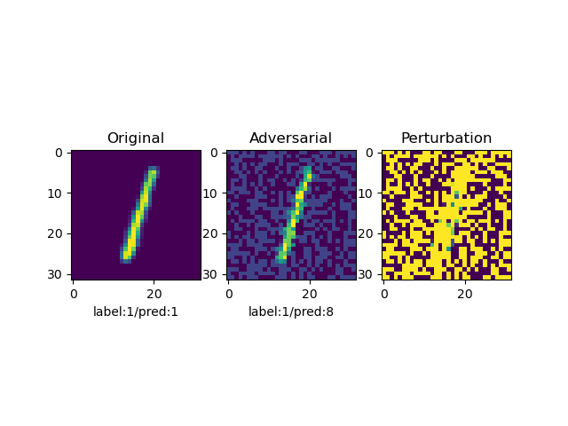

<h2>신뢰할수있는 인공지능 Assignment1</h2>
MNIST와 CIFAR10 Dataset을 이용하여 FGSM,PGD에 대한 성능을 시뮬레이션 하는 프로그램

각 데이터셋의 데스트 세트 중 100개의 샘플에 대한 공격 성공률 측정 후 이미지(png)로 저장

<h3>구성 요소</h3>
test.py: 모델 학습, 시뮬레이션 수행 및 결과 저장을 수행하는 코드

requirements.txt: 프로젝트 실행을 위해 필요한 라이브러리 목록

results/: 공격 전 후의 이미지 및 라벨 분류 결과가 저장되는 폴더

<h2>실행방법</h2>
pip install -r requirements.txt #필수 라이브러리 설치

python test.py #프로그램 실행

<h2>예상 결과</h2>
1. 각 모델 train 결과(MNIST 90%이상, Cifar10 85% 이상)

2. 각 모델에 대한 어택 결과

3. 공격 전 후의 이미지 파일(png)

   /results/mnist 와 /results/cifar10 폴더에 각 공격별로 5개의 이미지가 저장됨

   

<h2>Implementation Detail</h2>
Models

MNIST: Custom CNN 구조 사용

Cifar10: Pre-trained ConvNext-Tiny 모델 활용

Attacks:

PGD: k = 30, eps_step = 0.01 사용
